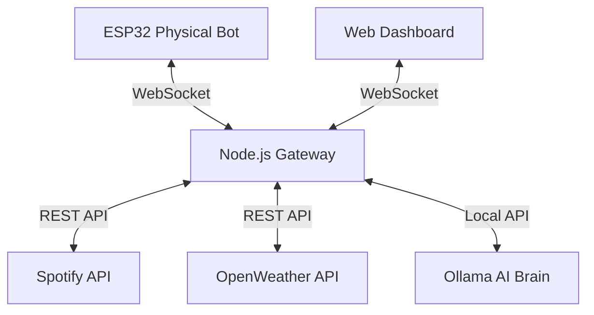

# 🛠 SYSTEM ARCHITECTURE: Mochi Blueprint

Mochi is built on a 3-layer architecture that separates physical hardware control, the API gateway logic, and the user-facing interface.

## ⚙️ The Ecosystem

## 1. Physical Layer (ESP32)
- **Core:** ESP32-WROOM-32.
- **Role:** Handles immediate sensor feedback and physical "body language."
- **Hardware Peripherals:**
    - **OLED (I2C):** Displays primary eye animations (Blinking, Looking).
    - **LCD 16x2 (Parallel):** Secondary status bar (Time, Weather, Track Name).
    - **RGB LED:** Mood indicator (Cyan=Vibing, Red=Alert, Yellow=Talk, Purple=Mood).
    - **Buzzer:** Haptic alerts and "chirps."
    - **Touch Sensor:** Trigger for `TOUCH_EVENT` (Mochi reacts to pets).

## 2. Gateway Layer (Node.js)
- **Role:** The central nervous system. Manages all states and routes messages.
- **Key Logic:**
    - **WebSocket Server:** Bridges the ESP32 and Web Dashboard.
    - **AI Context Builder:** Injects real-time dashboard data (Mood, Track, Weather) into Ollama's system prompt.
    - **Spotify Manager:** Handles OAuth tokens, periodic persistence to `spotify_tokens.json`, and playback control logic.
    - **Weather Monitor:** Polls OpenWeather every 15 mins; triggers `RAIN_WARNING` if detection occurs.

## 3. Interface Layer (Next.js)
- **Tech:** Next.js, Framer Motion, Lucide icons.
- **Design:** "8-bit Bento." Pixel-art themed grid cards.
- **Communication:** Sends `CHAT_REQUEST` and `SPOTIFY_CONTROL` messages; receives `MOOD_UPDATE`, `WEATHER_UPDATE`, and `BOT_STATUS`.

## 📡 WebSocket Messaging Schema (JSON)

| Type | Source | Description |
| :--- | :--- | :--- |
| `CHAT_REQUEST` | Dashboard | User sends a text message for Mochi's brain. |
| `CHAT_RESPONSE` | Gateway | Mochi's AI response to be displayed in chat. |
| `MOOD_CHANGE` | Gateway | Tells ESP32 which hardware animation to play. |
| `MOOD_UPDATE` | Gateway | Synchronizes the Dashboard UI face with the current mood. |
| `TOUCH_EVENT` | ESP32 | Triggered when Abrar "pets" the physical bot. |
| `SPOTIFY_CONTROL` | Dashboard | `play`, `pause`, `next`, `previous` actions. |
| `RAIN_WARNING` | Gateway | Sent when OpenWeather predicts rain soon. |

---
> [!IMPORTANT]
> All communication is real-time. If the ESP32 disconnects, the Dashboard sidebar will show a **SYSTEM_OFFLINE** status.
